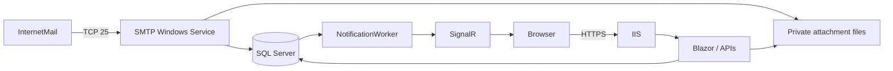

# TempMail — receive-only disposable email

Self-hosted .NET 10 application for choosing a temporary address and reading incoming mail in a private browser inbox. Web runs on IIS; SMTP runs as an independent Windows Service. **No send, reply, forward, SMTP AUTH or relay functionality.**

Built with ASP.NET Core / Blazor Interactive Server, Bootstrap 5.3.8, EF Core + SQL Server, ASP.NET Core Identity/Data Protection, SignalR, MimeKit, HtmlSanitizer and Serilog. Security and correct receipt take priority over UI complexity.

## Features

- Random or custom local part, multiple active domains, configurable reserved names, normalized unique addresses and database-enforced allocation.
- Browser-bound encrypted/HttpOnly cookie with random session/access tokens; knowing the address or public ID grants no inbox access.
- Live inbox, sender/subject/time/size/attachment indicator, safe text/HTML views, copy feedback, change address, clear inbox, delete message, countdown and capped extension.
- MIME UTF-8/Unicode, quoted-printable/base64, multipart plain/HTML, regular and inline attachments. Attachments are private, forced-download files; inline PNG/JPEG/GIF/WebP images are rendered from authorized attachments as embedded data; SVG/HTML remains download-only.
- Receive-only SMTP, active-local-domain enforcement, recipient validation, byte/recipient/connection/rate quotas, durable SQL + event transaction and retryable notification/cleanup workers.
- Identity-protected admin dashboard: domains, active mailboxes, stored messages, attachment size, SMTP connections/heartbeat, retained-mail daily/hourly counts, sender/domain/local-part blocks and reserved-name rules.
- Antiforgery, strict cookies, security headers/CSP, sandboxed sanitized email HTML, external images blocked by default, authenticated attachments, expiration and rolling logs.

## Scope and production acceptance

Follow the ordered [Windows production checklist](docs/production-checklist.md) from clean server through Internet delivery and backup/restore.

This is source code and deployment automation, **not an already-provisioned production server**. Validate it in your Windows/SQL/IIS environment and complete the checklist below before exposing it publicly. The SMTP receiver supports optional STARTTLS with TLS 1.2/1.3 using a Windows Certificate Store certificate or PFX. Configure a valid certificate to advertise STARTTLS; `RequireStartTls` defaults to false for Internet inbound compatibility. DKIM/SPF/DMARC validation and malware scanning are not implemented. Only signature-checked raster CID images render inline; other MIME parts remain downloads. Single Web worker / single SMTP instance only; not a distributed service. See [security](docs/security.md), [SMTP](docs/smtp.md) and [validation results](docs/validation.md).

## Architecture



```text
TempMail.sln
src/
  TempMail.Domain/          Entities
  TempMail.Application/     Options, address policy, token primitives
  TempMail.Shared/          DTOs
  TempMail.Infrastructure/  EF/Identity, migration, MIME, storage, services
  TempMail.Web/             Blazor, API, admin, SignalR, cleanup
  TempMail.SmtpServer/      SMTP protocol, Windows Service
 tests/
  TempMail.UnitTests/
  TempMail.IntegrationTests/
 deployment/               PowerShell installers, migration SQL, cloud setup
 docs/                     Architecture, deployment, DNS, security, SMTP
```

Read [architecture.md](docs/architecture.md) for transaction boundaries, cookie ownership, retention and the notification mechanism.

## Requirements

- .NET SDK **10.0.401** (global.json; latest patch roll-forward), .NET 10 runtimes.
- SQL Server 2022+ / Express for actual application use. SQLite is used **only by the automated integration test host**, never as an implicit production fallback.
- Windows Server 2022/2025, IIS + WebSockets + .NET 10 Hosting Bundle for production.
- Private storage/key/log paths; public DNS and inbound port 25 for Internet delivery.
- Node/Chromium are optional, only for the opt-in browser test. Bootstrap/SignalR browser assets are checked in; no CDN or Node build required for normal restore/build/publish.

## Build and test

From the root:

```powershell
dotnet tool restore
dotnet restore --locked-mode
dotnet build -c Release
dotnet test -c Release
dotnet publish -c Release
```

Package versions and NuGet lockfiles are committed; normal `dotnet restore` also works. TreatWarningsAsErrors and nullable references are enabled. `dotnet test` uses a real ASP.NET Core test host with relational SQLite, plus an actual TCP SMTP conversation. It verifies address rules, duplicate names, ownership/IDOR including attachment/HTML, CSRF, cookies, expiry, MIME/attachments, sanitizer, traversal, cleanup, health and relay rejection. SQL-specific behavior still needs SQL Server acceptance testing; SQLite cannot prove SQL locking/deadlock/collation behavior.

Optional full browser test installs only development tooling (outside the checkout if preferred):

```bash
npm install --prefix /tmp/tempmail-browser --ignore-scripts playwright-core
export PLAYWRIGHT_MODULE=/tmp/tempmail-browser/node_modules/playwright-core
export CHROMIUM_PATH=/usr/bin/chromium
TEMPMAIL_BROWSER_SMOKE=1 dotnet test -c Release --filter FullyQualifiedName~BrowserTests
```

On Windows set equivalent environment variables and point CHROMIUM_PATH to installed Chrome/Chromium. The test generates a disposable local HTTPS certificate and asks the isolated browser context to accept **that test certificate only**. Production TLS validation is unchanged. It starts a real Kestrel server, drives Blazor, delivers via TCP SMTP, verifies SignalR update/HTML isolation/mobile layout, checks anonymous access denial and signs into admin. Screenshots are written to ignored `artifacts/`. Without opt-in the browser test is explicitly skipped. A separate SQL Server test is also skipped unless `TempMailTest__SqlConnection` is supplied securely. That identity must be able to create/drop a temporary database: the test creates a random `TempMailTest_*` database, applies migrations, checks concurrent duplicate allocation and deletes only that test database. Never point it at a production identity.

## Development database/configuration

Create a SQL database (LocalDB/SQL Express on Windows, or a supported SQL Server container on Linux). Never check in production secrets. For a local SQL container supply a randomly generated SA password securely; bind 1433 only to loopback and do not reuse SA in production. No Docker dependency is needed to run the default tests.

Create ignored `src/TempMail.Web/appsettings.Local.json` and corresponding SMTP local config, or set environment variables in each shell:

```powershell
# Development ONLY: local trusted SQL instance. Use validated SQL TLS certificates in production.
$env:ConnectionStrings__DefaultConnection = 'Server=localhost;Database=TempMail;Integrated Security=true;Encrypt=true;TrustServerCertificate=true'
$env:TempMail__StoragePath = 'C:\TempMailDev\storage'
$env:TempMail__DataProtectionPath = 'C:\TempMailDev\keys'
$env:AllowedHosts = 'localhost'
$env:Smtp__Host = '127.0.0.1'
$env:Smtp__Port = '2525'
# Inject a cryptographically random 32+ character Security__IpHashKey through your secret store.
dotnet ef database update --project src\TempMail.Infrastructure
dotnet run --project src\TempMail.Web -- --seed
```

Linux paths must be absolute Linux paths (e.g. `/workspace/tempmail-local/storage` and `/workspace/tempmail-local/keys`), not the Windows defaults in appsettings.json. SMTP starts with content root at its output directory; use environment variables for `dotnet run` to avoid ambiguity. Both processes must share DB, storage and policy configuration.

To generate a local HMAC key without printing it:

```powershell
$bytes = New-Object byte[] 32
[System.Security.Cryptography.RandomNumberGenerator]::Create().GetBytes($bytes)
$env:Security__IpHashKey = [Convert]::ToBase64String($bytes)
```

Persist that key securely if you want IP quotas to remain stable across development sessions. Configure a development HTTPS certificate using `dotnet dev-certs https --trust` on supported developer machines. Production should use the issued certificate described below.

## Run locally

Terminal 1 (Web, environment/config variables set):

```powershell
$env:ASPNETCORE_ENVIRONMENT = 'Development'
dotnet run --project src\TempMail.Web --urls https://localhost:7043
```

Terminal 2 (SMTP, same database/storage/policies):

```powershell
dotnet run --project src\TempMail.SmtpServer
```

Create an address in the UI before sending to it. Use SMTP port 2525 locally; replace the port in [SMTP tests](docs/smtp.md). No DNS change is needed for manual localhost SMTP tests. Real Internet senders always use MX/port 25. The no-account browser flow has no password recovery: deleting cookies loses mailbox access.

## Initial admin and domains

No hard-coded or default admin password. Seed domains/role with `--seed`. Create an initial admin only with explicit `--bootstrap-admin` and securely supplied `AdminBootstrap__Email` / `AdminBootstrap__Password`; remove those values afterward. Existing accounts are never reset by bootstrap. Full PowerShell secure-prompt instructions are in [deployment](docs/deployment.md#6-seed-and-initial-admin).

Log into `/admin` over HTTPS. Add/enable/disable domains, inspect counters/SMTP heartbeat, add sender or domain blacklist rules and reserve additional local parts. Domain deletion is refused while mailboxes reference it; disable it first and let mailboxes expire. Configured reserved names and DB-managed names both apply. Configuration-provided names are edited in appsettings/environment; DB rules in admin. A new domain also needs valid DNS/MX.

## Configuration reference

Both appsettings.json files show all defaults. Nested environment names use `__`.

| Section / option | Default / purpose |
|---|---|
| ConnectionStrings:DefaultConnection | Empty: must be supplied securely |
| AllowedHosts | localhost: change for IIS hostname |
| TempMail:Domains | mail.example.com: initial seed only |
| MailboxLifetimeHours / MessageLifetimeHours | 24 / 24 |
| AllowCustomAddress / AllowMailboxExtension | true / true |
| MaxMailboxLifetimeHours | 72, hard cap from creation |
| StoragePath / DataProtectionPath | D:\TempMailStorage / D:\TempMailKeys |
| DataProtectionCertificateThumbprint | Optional portable Windows key protection; otherwise production Windows DPAPI |
| MaxMessagesPerMailbox / MaxMailboxesPerIp | 100 / 10 |
| MaxStorageMB | 10240 logical retained MIME bytes; use lower for Express |
| CleanupIntervalSeconds | 60; physical orphan safety grace 1 hour |
| CreateRequestsPerMinute / DeleteRequestsPerMinute / ReadRequestsPerMinute | 10 / 20 / 120 per IP |
| ReservedNames | admin, administrator, root, postmaster, abuse, support, webmaster, hostmaster |
| Security:IpHashKey | Required random secret ≥32 chars for HMAC IP storage |
| Smtp:Host / Port | 0.0.0.0 / 25 |
| MaxMessageSizeMB / MaxAttachmentSizeMB | 20 / 10 |
| MaxRecipients / RejectUnknownMailbox | 10 / true |
| MaxConnections / MaxConnectionsPerIp | 100 / 5 |
| MaxConcurrentMessages | 4 concurrent DATA/parse/storage operations |
| MessagesPerMinutePerIp | 30 |
| CommandTimeoutSeconds / ConnectionLifetimeSeconds | 60 / 300 |
| Smtp:RequireStartTls | false; reject plaintext MAIL/RCPT/DATA with 530 when enabled |
| Smtp:TlsHandshakeTimeoutSeconds | 15 (1–120), bounded by connection lifetime |
| Smtp:Tls | Certificate Store/PFX settings; see [SMTP TLS configuration](docs/smtp.md#tls-configuration) |
| Logging:FilePath | logs/web-.log or logs/smtp-.log, daily and 50 MB rolling, retain 14 files |

Username: case-insensitive 3–40 ASCII characters, letters/digits/dot/dash/underscore, first/last alphanumeric, no repeated dots. The stricter dot rules improve SMTP interoperability. Unspecified local part uses 64 random bits rendered as 16 lower-case hex characters; access uses a separate 256-bit token.

## API and realtime

Call `GET /api/session` first to receive the HttpOnly session cookie and request antiforgery token; send `X-CSRF-TOKEN` on every API write. Tokens in this JSON are antiforgery request tokens, **not mailbox access tokens**. Renew antiforgery token after admin login/logout because the authenticated identity changes.

```text
GET    /api/domains
POST   /api/mailboxes
GET    /api/mailboxes/current
DELETE /api/mailboxes/current
DELETE /api/mailboxes/current/messages
POST   /api/mailboxes/current/extend
GET    /api/messages
GET    /api/messages/{id}
GET    /api/messages/{id}/html?images=false
DELETE /api/messages/{id}
GET    /api/messages/{id}/attachments/{attachmentId}
```

Mailbox APIs resolve ownership exclusively from cookie. No route accepts an access token, arbitrary storage path or mailbox override. Validation/authorization failures use ProblemDetails and 400/404/409/429; 404 avoids cross-inbox distinction. IDs are GUIDs, not sequential database IDs. The `/mailhub` method `JoinMailbox` chooses its own authorized group `mailbox:{PublicId}`; callers cannot supply a group name. Events contain invalidations only, and all subsequent reads recheck ownership/expiry.

## Deployment and operations

- [Windows Server / IIS / Windows Service / HTTPS / ACL / migrations / backup / upgrades](docs/deployment.md)
- [DNS A/MX, Cloudflare DNS Only, provider port-25 restrictions](docs/dns.md)
- [SMTP commands, telnet/Test-NetConnection, receive-only limitations](docs/smtp.md)
- [Threat review and production security responsibilities](docs/security.md)

Scripts: `deployment/install-iis.ps1`, `install-smtp-service.ps1`, `uninstall-smtp-service.ps1`, `firewall.ps1`. They preserve existing local settings and storage. Review paths/identities before running; they require administrator privileges. They do not silently perform destructive migrations. `deployment/migrate.sql` is the generated idempotent initial schema.

Health: `/health/live` for process liveness, `/health` and `/health/ready` for database/schema/storage writes; SMTP has a persisted heartbeat visible in admin and authenticated `/api/admin/smtp-health`. Readiness does not prove public DNS/port reachability or successful external email delivery. Monitor both plus an external delivery probe. Keep IIS active (AlwaysRunning/preload with IIS Application Initialization if required) so cleanup/notifications run without active browsers.

Serilog logs requests and SMTP envelope/connection metadata, not body, cookies or access tokens. Logs still contain personal data; restrict and rotate them. Quotas are not an antivirus or distributed DDoS defense. Back up SQL, attachments, protected configuration, keys/certificates together and test restores. See the troubleshooting table in deployment documentation.

## Production checklist

- [ ] SQL Server configured
- [ ] Storage directory configured
- [ ] IIS installed
- [ ] Hosting Bundle installed
- [ ] HTTPS certificate installed
- [ ] SMTP Windows Service installed
- [ ] TCP 25 opened
- [ ] TCP 443 opened
- [ ] A record configured
- [ ] MX record configured
- [ ] Port 25 tested externally
- [ ] Admin password changed (initial unique strong password provisioned; no default exists)
- [ ] Data Protection configured
- [ ] Rate limiting enabled
- [ ] Storage limit configured
- [ ] Logs configured
- [ ] Backup configured
- [ ] SQL migrations reviewed/applied and Windows service identities least-privileged
- [ ] One IIS worker; non-overlapping recycling; Web kept active for background work
- [ ] SMTP certificate/renewal/ACL configured, TLS 1.2/1.3 and optional plaintext policy verified
- [ ] SQL Server concurrency, restart/restore and external Gmail/Outlook delivery validated in staging

## Automation API

See [mailbox and OTP automation](docs/automation-api.md) for shared-token configuration, contracts, limits, and the required POST-before-send workflow.
