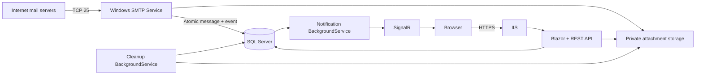

# Architecture

.NET 10 / ASP.NET Core, Blazor Interactive Server, local Bootstrap 5.3.8 assets, EF Core SQL Server, Identity, MimeKit, HtmlSanitizer, SignalR and Serilog. No Redis dependency. No outbound email code.

## Boundaries

- **Domain**: mail domains, mailbox, message, attachment, block rule, outbox event, SMTP heartbeat.
- **Application**: options, validation, address generator, token primitives, policy errors.
- **Shared**: API DTOs. Browser never receives the access token or token hash.
- **Infrastructure**: EF/Identity store, migrations, mailbox/receive services, MIME parsing, sanitization, private file storage and cleanup.
- **Web**: Blazor UI, session/CSRF/security middleware, REST endpoints, Identity administration, SignalR dispatcher, health checks.
- **SmtpServer**: bounded receive-only SMTP protocol and connection worker; Windows Service lifetime. Independent of IIS.

## Ownership and lifecycle

A browser receives a protected HttpOnly cookie containing a 256-bit MailboxSessionId and a separate 256-bit MailboxAccessToken. SQL holds only SHA-256 of the token. Each API request resolves an unexpired mailbox from that token; all message queries add MailboxId and ExpiresAt predicates. Public GUIDs are identifiers, never authorization. An inbox URL does not grant access. A browser has one active mailbox; changing address deletes the old mailbox first. Losing the cookie means losing access. Cookies live up to 31 days; mailbox lifetime remains enforced by the database.

Unique `NormalizedAddress` prevents duplicate names. SQL Server application locks inside serializable transactions serialize mailbox allocation (quota/uniqueness) and message allocation (quota enforcement). Unavailability or DB failure never results in SMTP 250. A message with multiple valid recipients is stored atomically. Unknown recipients are rejected by default; disabling rejection accepts and discards unknown local addresses, without auto-creating public/unowned mailboxes.

## Files and transactions

Attachments are decoded with byte/count limits, named with independent random storage IDs, and stored before the database commit. They are never put below wwwroot. The server only returns 250 after the DB transaction commits. A failed transaction can leave an orphan file; cleanup retries a physical orphan sweep after a one-hour safety window. DB row deletion immediately revokes download access. Back up both DB and storage. This design tolerates process interruption; monitor free disk and cleanup failures.

## Notifications and deployment boundary

Message and outbox event commit together. The Web worker polls undispatched events every second, sends an `InboxChanged` invalidation, then marks each event dispatched. Failure between send and mark can duplicate an invalidation; clients reload idempotently. No content is sent in notification payloads. Reconnect joins only the server-resolved authorized group and reloads inbox. A 30-second fallback reload recovers lost notifications.

**One Web worker / one SMTP instance per installation.** IIS web gardens and multiple Web nodes are not supported by this dispatcher; keep `maxProcesses=1` and disable overlapping recycling. Scale-out requires per-instance event cursors plus a SignalR backplane or another broadcast transport. Do not deploy multiple replicas silently. SMTP runs continuously even while IIS recycles; it stores notifications for later delivery. Cleanup and notification processing require Web to be running.

Database timestamps are UTC. Domain disabling rejects new SMTP delivery, but does not silently delete existing owned mailboxes. Lifetime extension is capped at CreatedAt + MaxMailboxLifetimeHours; message lifetime is independent. Statistics represent retained messages, not an immutable analytics ledger.
